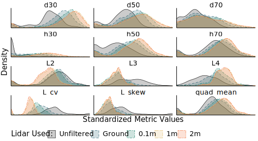

```{r, include=FALSE}
knitr::opts_chunk$set(results = 'asis',
                      echo = FALSE,
                      warning = FALSE,
                      tidy = FALSE,
                      message = FALSE,
                      fig.align = 'center',
                      out.width = "100%")
options(knitr.table.format = "html") 
```

```{r myplot, include=FALSE}
svg('myplot.svg')
plot(iris$Sepal.Length, iris$Sepal.Width)
dev.off()
```

# Introduction

Airborne LiDAR has become an essential data source for large-scale modeling of 
forest aboveground biomass, enabling predictions with higher resolution and 
accuracy than can be achieved using optical imagery alone. 
Ground noise filtering -- that is, excluding returns from LiDAR point clouds 
based on height thresholds -- is a common practice meant to improve the 'signal' 
content of LiDAR returns by preventing ground returns from masking useful 
information about tree size and condition contained within canopy returns. 

Originating from LiDAR-based estimation of mean tree and 
canopy height (Næsset, 1997), ground noise filtering has remained prevalent in 
LiDAR pre-processing across domains, including aboveground biomass estimation.
In this new domain, ground returns may actually provide useful 
information about stand density and openness. In particular, ground returns 
may be helpful for making accurate biomass predictions in heterogeneous 
landscapes that include a patchy mosaic of vegetation heights and land cover 
types.
  
# Methods

We applied several height thresholds (no filtering, filtering points classified 
as "ground", and filtering all points below 0.1, 1, and 2 meters above ground) 
to leaf-off LiDAR data flown for two regions within New York State (USA). 
The first area represents the majority of New York's Cayuga and Oswego counties, 
a mixed agricultural and developed landscape with a large amount of marginal 
forestland with fragmented tree cover. The second area covers the northern 
sections of Warren and Washington counties and the southern section of Essex 
county, a predominantly forested region largely within New York's Adirondack 
Park.

We fit random forests to predict forest aboveground biomass calculated
from FIA plot measurements, using metrics derived from the filtered LiDAR data 
sets as predictors. Separate models were fit to each region, as well as to a 
combined data set. Model accuracy was assessed against a hold-out set made from
30% of available FIA plots.

<br />

# Results

Predictors derived from filtered LiDAR had lower variance across plots and higher
correlations between predictors. This combination results in lower amounts of 
information available to each model.

```{r dists, echo = FALSE, fig.cap="Distributions of common LiDAR-derived metrics (including density percentiles, decile heights, L-moments (from Hosking, 1990), and quadratic mean height) for the pooled dataset at various levels of ground noise filtering. Filtering reduces the variance in many metrics, reducing the total amount of information available to models."}

```

Perhaps as a result, models consistently performed better when using predictors 
derived from less-filtered data sets. This trend was most noticeable in the 
mixed-use landscape, likely due to the higher proportion of near-ground returns 
in the region.

```{r deltas, echo = FALSE, fig.cap="Height threshold-based filtering of LiDAR returns produces inferior models across all landscape types, with more notable impacts in mixed-use landscapes"}
knitr::include_graphics("deltas.svg")
```

Although well-justified in its original context of modeling mean stand 
heights, ground noise filtering for LiDAR-based AGB modeling 
appears to produce less accurate predictions than could be achieved using 
currently available data.

# References

<p style="font-size:80%;"> 
Hosking, J. R. M. (1990). _J R Stat Soc Series B Stat Methodol_ 52: 105-124.  
Næsset, E. (1997). _ISPRS J. Photogramm. Remote Sens_ 52: 49-56.
</p>
